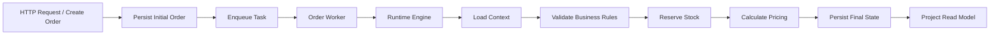
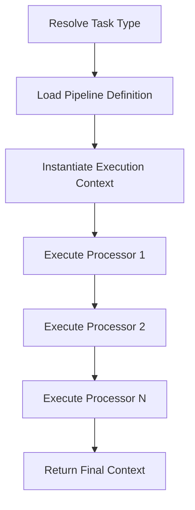
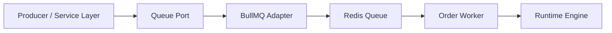
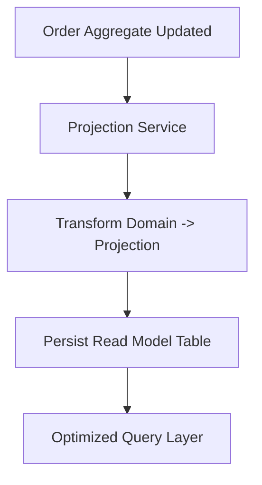
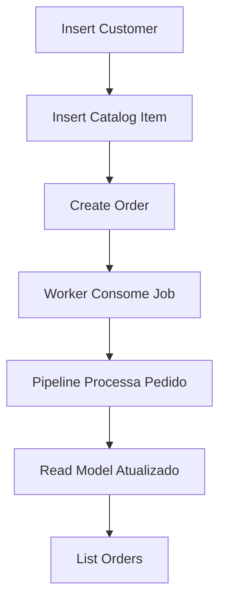

# README — Arquitetura da Solução

# Lea Record Shop API

## Visão Geral da Arquitetura

Esta aplicação foi estruturada com foco em **modularidade**, **escalabilidade horizontal**, **baixo acoplamento** e **evolução incremental da arquitetura**, adotando princípios inspirados em:

- Domain-Driven Design (DDD)
- Clean Architecture
- Pipeline Processing / Runtime Engine
- CQRS-like Read Projection (sem CQRS formal)
- Event/Queue Driven Processing

---

## Objetivos Arquiteturais

A estrutura foi projetada para:

- Isolar regras de negócio da infraestrutura e frameworks
- Facilitar manutenção e testes unitários
- Permitir evolução incremental sem grandes refactors
- Preparar o sistema para workloads assíncronos e escaláveis
- Suportar projeções de leitura desacopladas do write model
- Habilitar futura distribuição horizontal de workers

---

## Seed de Desenvolvimento

O projeto suporta população automática de dados inicais para facilitar testes.

Para habilitar:

```env
ENABLE_SEED=true
```

Ao iniciar a aplicação:

- Clientes de teste serão criados
- Itens de catálogo serão populados
- Pedidos podem ser gerados via endpoint `/order/create`

---

# Estrutura de Pastas

```text
src/
├── app/
│   ├── catalog/
│   ├── customer/
│   ├── order/
│   ├── stock/
│   ├── common/
│   ├── error/
│   └── test/
│
├── core/
│   ├── processing/
│   └── queue/
│
├── infra/
│   ├── database/
│   └── redis/
│
├── app.module.ts
└── main.ts
```

---

# Fluxo de Processamento de Pedido

## Pipeline Assíncrono



---

# Fluxo Interno do Runtime Engine



---

# Fluxo Worker + Queue



---

# Fluxo de Dados / Read Model Projection



---

# Organização Modular

## app/catalog

Responsável pelo gerenciamento do catálogo de discos.

```text
catalog/
├── domain/              # Modelos e regras de domínio do catálogo
├── infra/               # Persistência, ORM e queries de leitura
├── catalog.service.ts   # Orquestra casos de uso
├── catalog.controller.ts# Exposição HTTP
└── catalog.module.ts    # Composição DI do módulo
```

---

## app/customer

Responsável pelo gerenciamento de clientes.

```text
customer/
├── domain/               # Modelo de domínio do cliente
├── infra/                # Persistência e mapeamento ORM
├── customer.service.ts   # Casos de uso
├── customer.controller.ts# Endpoints HTTP
└── customer.module.ts    # Composição DI
```

---

## app/order

Módulo central de pedidos e principal núcleo transacional da aplicação.

---

### Domínio

```text
order/domain/
├── order.aggregate.ts    # Aggregate root do pedido
├── order.types.ts        # Tipos / enums de domínio
└── errors.ts             # Exceções de domínio
```

---

### Aplicação / Orquestração

```text
order/app/
├── processors/           # Etapas individuais do pipeline
├── tasks/                # Definições de task / pipeline registration
├── read-model/           # Queries de leitura desacopladas
└── order.worker.ts       # Worker consumidor da fila
```

#### Responsabilidades dos Processors

Cada processor possui responsabilidade única no pipeline:

- Carregamento de dependências/contexto
- Validações de negócio
- Reserva de estoque
- Cálculo de preço
- Atualização de read model
- Persistência final

---

### Infraestrutura

```text
order/infra/
├── order.entity.ts
├── order.mapper.ts
├── order.repository.ts
├── order.impl.repository.ts
├── order-read-model.entity.ts
├── order-read-model.repository.ts
└── order-projection.service.ts
```

---

## app/stock

Camada de abstração de estoque.

```text
stock/
└── Infraestrutura / Repositórios de estoque
```

---

## app/common

Objetos de domínio compartilhados.

```text
common/
├── money/               # Value Object monetário
└── pricing/             # Estrutura de precificação
```

---

## app/error

Erros compartilhados entre módulos.

---

## app/test

Testes unitários e de integração de componentes críticos.

Foco atual:

- Runtime de processamento
- Pipeline de pedidos
- Worker assíncrono

---

# Core Técnico

## core/processing

Kernel interno responsável pelo motor de processamento da aplicação.

```text
processing/
├── processor.ts
├── runtime.engine.ts
├── pipeline.registry.ts
├── execution.context.ts
└── task.registry.ts
```

---

### Responsabilidades

- Registrar pipelines
- Resolver pipelines por tipo de task
- Executar processors sequencialmente
- Compartilhar contexto de execução entre etapas
- Centralizar tratamento de fluxo de processamento

---

### Pattern Utilizado

> **Registry + Runtime Engine + Processor Pipeline**

---

## core/queue

Abstração desacoplada do sistema de filas.

```text
queue/
├── queue.port.ts
├── queue-bull.adapter.ts
└── queue.tokens.ts
```

---

### Benefícios

- Permite trocar BullMQ / RabbitMQ / SQS sem alterar domínio
- Isola detalhes de infraestrutura
- Facilita testes e mocking

---

# Infraestrutura Compartilhada

## infra/database

Configuração global de banco / TypeORM.

---

## infra/redis

Infraestrutura Redis compartilhada.

Inclui:

- Conexão
- Providers
- Configuração global
- Reuso para Queue / Cache / Locks

---

# Estratégias Arquiteturais Relevantes

## Separação de Write / Read Concerns

Embora não seja CQRS formal, a solução adota separação parcial de leitura e escrita:

- **Write Model:** Entidade transacional principal (`OrderEntity`)
- **Read Model:** Projection table otimizada para consultas/listagens

Benefícios:

- Consultas mais performáticas
- Redução de acoplamento com domínio transacional
- Facilidade de evolução futura para CQRS completo

---

## Preparação para Escalabilidade Horizontal

A arquitetura foi desenhada para suportar:

- Múltiplos workers concorrentes
- Distribuição horizontal de processamento
- Retry / Dead-letter future support
- Processamento desacoplado da thread HTTP

---

## Atomicidade e Consistência

Garantias atuais contempladas por:

- Controle transacional no write model
- Pipeline determinístico e sequencial
- Reserva de estoque centralizada
- Possibilidade de evolução para locks distribuídos / optimistic concurrency

---

# Justificativa Arquitetural

Esta arquitetura foi escolhida para demonstrar capacidade de projetar sistemas além do CRUD tradicional, contemplando:

- Separação clara de responsabilidades
- Modelagem orientada a domínio
- Pipeline engine reutilizável
- Infraestrutura desacoplada por portas/adapters
- Processamento assíncrono escalável
- Projeções de leitura otimizadas
- Preparação para crescimento arquitetural real

---

# Execução do Projeto

## infrqa

```bash
    docker-compose up -d
```

## Setup

```bash
pnpm install
```

---

## Desenvolvimento

```bash
pnpm run dev
```

---

## Produção

```bash
pnpm run start:prod
```

---

## Testes

```bash
pnpm run test
```

---

# API Reference

## Base URL

```text
http://localhost:3000
```

---

# Order Endpoints

## Create Order

Cria um novo pedido e dispara o pipeline assíncrono de processamento.

### Endpoint

```http
POST /order/create
```

### Payload

```json
{
  "customerId": "3162b3d9-bf11-4c1e-9329-5646749cd025",
  "catalogId": "1b07636c-ab0f-46d1-8a4b-38766b3b0307",
  "quantity": 1
}
```

---

## List Orders

Lista pedidos com filtros opcionais.

### Endpoint

```http
GET /order/list
```

### Query Params

```ts
interface OrderQueryFieldsProps {
  customerId?: string;
  startDate?: Date;
  endDate?: Date;
}
```

### Example

```http
GET /order/list?customerId=UUID&startDate=2026-01-01&endDate=2026-12-31
```

---

# Catalog Endpoints

## Insert Catalog Item

Cria um novo item no catálogo.

### Endpoint

```http
POST /catalog/insert
```

### Payload

```json
{
  "name": "Random Access Memories",
  "artist": "Daft Punk",
  "releaseYear": 2014,
  "style": "Tech",
  "quantity": 10,
  "price": 10.0,
  "perOrder": 6
}
```

---

## Update Catalog Item

Atualiza um item existente do catálogo.

### Endpoint

```http
POST /catalog/update
```

### Payload

```json
{
  "id": "cc579c1a-6ee5-4ad2-b817-98e13fef275b",
  "name": "Random 5 Access Memories",
  "artist": "Daft Punk",
  "releaseYear": 2013,
  "style": "Electronic",
  "quantity": 10,
  "price": 10.0,
  "perOrder": 6
}
```

---

## List Catalog Items

Lista itens do catálogo com filtros opcionais.

### Endpoint

```http
GET /catalog/list
```

### Query Params

```ts
interface CatalogQueryProps {
  name?: string;
  artist?: string;
  style?: string;
  releaseYear?: string;
}
```

### Example

```http
GET /catalog/list?artist=Daft%20Punk&style=Electronic
```

---

# Customer Endpoints

## Insert Customer

Cria um novo cliente.

### Endpoint

```http
POST /customer/insert
```

### Payload

```json
{
  "document": "12325678900",
  "fullName": "Gabriel",
  "birthDate": "1998-05-12",
  "email": "gabriel@example.com",
  "phone": "+55 11 99999-9999"
}
```

---

# Observações de Design

## Convenções Utilizadas

- Endpoints de escrita separados por contexto de domínio.
- Query parameters opcionais para filtros de leitura.
- Write operations desacopladas do read model onde aplicável.
- Processamento de pedidos ocorre de forma assíncrona após criação.

---

# Fluxo Esperado para Teste Manual



---

---

# Decisões Arquiteturais e Trade-offs

## Por que o processamento de pedidos é assíncrono?

O processamento de pedidos foi projetado de forma assíncrona para:

- evitar bloqueio da thread HTTP durante etapas de processamento mais pesadas;
- permitir escalabilidade horizontal dos workers;
- possibilitar estratégias futuras de retry/reprocessamento;
- desacoplar o ciclo de vida da requisição HTTP do pipeline de negócio.

### Trade-off Aceito

- Consistência eventual entre write model e read model.

---

# Melhorias Futuras

Possíveis evoluções arquiteturais planejadas para cenários de maior escala:

- Suporte a Dead Letter Queue (DLQ)
- Políticas de retry por processor
- Distributed Locking para reserva de estoque
- Observabilidade e tracing distribuído
- Métricas e monitoramento operacional
- Evolução para CQRS / Event Sourcing completo, se necessário

---

# Premissas e Restrições Técnicas

Algumas simplificações foram adotadas considerando o escopo do desafio:

- Fonte única de estoque (single warehouse)
- Integração com gateway de pagamento não contemplada
- Regras de precificação simplificadas para o escopo do challenge
- Consistência do read model é eventual por definição arquitetural

---

# Guia de Avaliação do Projeto

Sugestão de ordem para análise técnica da solução:

1. Ler a seção de arquitetura e decisões arquiteturais
2. Inspecionar o `core/processing` e o Runtime Engine
3. Analisar os processors do módulo de pedidos
4. Revisar a abstração de filas (`core/queue`)
5. Executar o fluxo de criação de pedido
6. Validar atualização do read model / projeções

---
